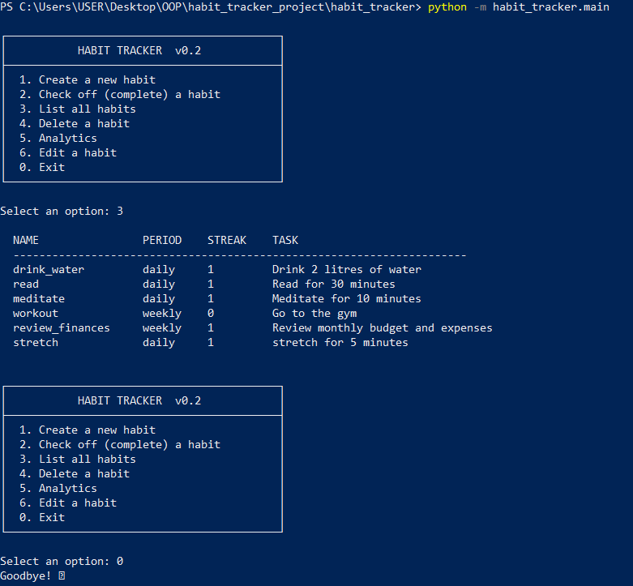
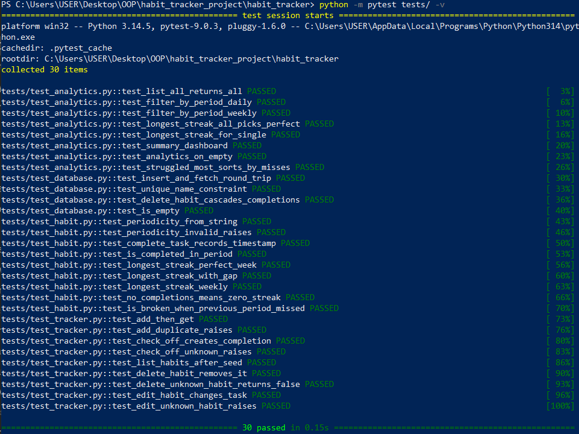

# Habit Tracker

A pure-Python backend for tracking recurring habits. Built for the IU course
**Object Oriented and Functional Programming with Python (DLBDSOOFPP01)**.

The application lets a user define daily and weekly habits, check them off,
persist data across sessions with SQLite, and analyse their behaviour through
a functional-programming analytics layer. The user interface is a thin,
interactive command-line REPL.

---

## Requirements

* Python **3.7 or later** (tested on 3.10 and 3.12)
* `pytest` for running the test suite

Only `pytest` is a third-party dependency — every other library used
(`sqlite3`, `datetime`, `functools`, `dataclasses`, `enum`) ships with the
Python standard library.

## Installation

```bash
# 1. Clone the repository
git clone https://github.com/<your-user>/oofpp_habits_project.git
cd oofpp_habits_project

# 2. (Optional) create a virtual environment
python -m venv .venv
source .venv/bin/activate         # on Windows: .venv\Scripts\activate

# 3. Install the test dependency
pip install pytest
```

No `setup.py` / `pyproject.toml` is required — the project runs directly from
the source tree.

## Running the application

```bash
python -m habit_tracker.main
```

On first launch, the database is automatically seeded with **5 predefined
habits** (3 daily + 2 weekly) and **4 weeks of completion fixture data**, so
you can immediately explore the features.

Once running, you'll see an interactive menu:

```
1. Create a new habit
2. Check off (complete) a habit
3. List all habits
4. Delete a habit
5. Analytics
6. Edit a habit
0. Exit
```


### Creating a habit

Choose option **1**, then enter:

* a unique short name (e.g. `meditate`)
* a free-form task description (e.g. `"Meditate for 10 minutes"`)
* a periodicity — `daily` or `weekly`

### Checking off a habit

Choose option **2**, type the habit name, and the current timestamp is
appended to that habit's completion log.

### Viewing your habits

Choose option **3** to see a table of all habits with their current streaks.

### Deleting a habit

Choose option **4**, type the habit's name, and it will be permanently
removed along with its full completion history.

### Analytics

Choose option **5** to access the functional analytics submenu:

* (a) all currently tracked habits
* (b) habits with a given periodicity
* (c) longest run streak across all habits
* (d) longest run streak for a given habit
* (e) habits you struggled most with in the last 30 days

### Editing a habit

Choose option **6**, type the habit's name, then optionally enter a new task
description and/or periodicity. Leave a prompt blank to keep its current
value. Editing preserves the habit's full completion history.

## Running the tests

```bash
python -m pytest tests/ -v
```


The full suite contains **30 tests across 4 test files**, mirroring the
package layout. Every test runs against an in-memory SQLite database
(`:memory:`) so the suite completes in well under a second.

## Project layout

```
habit_tracker/
├── __init__.py
├── habit.py          Habit dataclass + Periodicity enum
├── tracker.py        HabitTracker orchestrator (public API)
├── database.py       DatabaseManager (the only file with SQL)
├── analytics.py      Pure functions: list / filter / streaks (FP)
├── fixtures.py       5 predefined habits + 4 weeks of dummy data
├── cli.py            Interactive command-line interface
└── main.py           Entry point: `python -m habit_tracker.main`

tests/
├── conftest.py       Shared pytest fixtures (in-memory DB, seeded tracker)
├── test_habit.py     9 tests — domain logic, streaks, edge cases
├── test_database.py  4 tests — persistence round-trip, UNIQUE, CASCADE
├── test_tracker.py   9 tests — add / duplicate / check-off / KeyError
└── test_analytics.py 8 tests — all FP functions + summary + empty inputs
```

## Design notes

* **OOP** carries the domain model (`Habit`, `HabitTracker`, `DatabaseManager`).
* **FP** carries the analytics: every function in `analytics.py` is a pure
  function built on `filter`, `map`, `functools.reduce` and `lambda`s.
* The CLI is intentionally a *thin* layer — each menu branch is a single
  method call on `HabitTracker`. A future Tkinter/Flask front-end can re-use
  the same orchestrator without modifying any domain code.
* Streaks and "broken-habit" status are *derived* from the completion event
  log, never stored — so the data can never disagree with itself.

## License

Submitted as coursework. No external licence applied.
